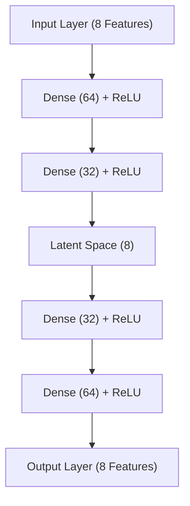
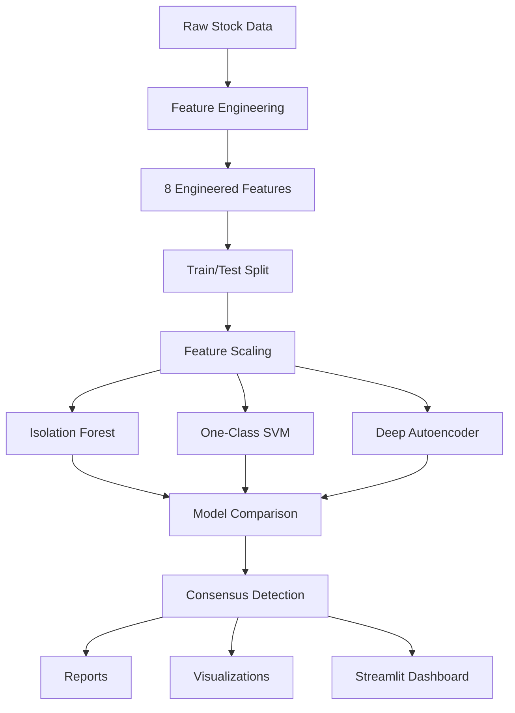

# Financial Anomaly Detection System

## Overview

An end-to-end Machine Learning and Deep Learning system for detecting anomalous behavior in financial time series data.

The project combines multiple unsupervised anomaly detection techniques, compares their outputs, identifies consensus anomalies, and automatically generates reports, visualizations, and dashboard-ready outputs.

Supported tickers:

- AAPL
- MSFT
- NVDA
- TSLA

---

## Key Features

### Data Processing Pipeline

- Historical stock data ingestion
- Automated feature engineering
- Time-series train/test splitting
- Feature scaling
- Reproducible model training
- Automated reporting

### Anomaly Detection Models

- Isolation Forest
- One-Class SVM
- Deep Autoencoder

### Evaluation Framework

- Model comparison
- Consensus anomaly detection
- Automated report generation
- Visualization generation
- Multi-ticker analysis

### Dashboard

- Streamlit-based interface
- Interactive anomaly exploration
- Model comparison support

---

## Features Used

All anomaly detection models operate on the same engineered feature set:

```python
FEATURES = [
    "return",
    "log_return",
    "volume_ratio",
    "volatility_7",
    "volatility_30",
    "price_ma10_ratio",
    "price_ma50_ratio",
    "return_zscore",
]
```

### Feature Descriptions

| Feature | Description |
|----------|------------|
| return | Daily percentage return |
| log_return | Logarithmic daily return |
| volume_ratio | Volume relative to 20-day moving average |
| volatility_7 | 7-day rolling volatility |
| volatility_30 | 30-day rolling volatility |
| price_ma10_ratio | Price relative to 10-day moving average |
| price_ma50_ratio | Price relative to 50-day moving average |
| return_zscore | Standardized return magnitude |

---

## Models

### Isolation Forest

Isolation Forest detects anomalies by recursively partitioning observations. Rare observations require fewer splits to isolate and therefore receive stronger anomaly scores.

**Advantages**

- Fast training
- Scales well
- Interpretable anomaly scores
- Strong baseline anomaly detector

---

### One-Class SVM

One-Class SVM learns a boundary around normal observations and flags points outside this boundary as anomalies.

**Advantages**

- Captures non-linear relationships
- Effective for high-dimensional feature spaces
- Strong unsupervised baseline

---

### Deep Autoencoder

The Autoencoder learns a representation of normal market behavior and identifies anomalies through reconstruction error.

## Autoencoder Architecture



### Reconstruction-Based Detection

1. The Autoencoder is trained on historical market behavior.
2. The network learns to reconstruct normal observations.
3. Reconstruction error is measured using Mean Squared Error (MSE).
4. Large reconstruction errors indicate anomalous observations.

---

## Consensus Detection

A high-confidence anomaly is defined as an observation independently detected by:

- Isolation Forest
- Autoencoder

Consensus anomalies are stored separately and represent the strongest anomaly candidates produced by the system.

---

## System Architecture



---

## Project Structure

```text
Finance/
│
├── app/
│   └── streamlit.py
│
├── configs/
│   ├── features.py
│   └── settings.py
│
├── data/
│   ├── raw/
│   └── processed/
│
├── models/
│
├── reports/
│   ├── figures/
│   └── results/
│
├── src/
│   ├── data/
│   ├── evaluation/
│   ├── models/
│   ├── pipelines/
│   └── visualization/
│
└── tests/
```

---

## Sample Results

### Isolation Forest Anomaly Detection

Insert screenshot:

```text
screenshots/aapl_isolationforest.png
```

### Autoencoder Anomaly Detection

Insert screenshot:

```text
screenshots/aapl_autoencoder.png
```

### Autoencoder Training Loss

Insert screenshot:

```text
screenshots/aapl_ae_loss.png
```

### Dashboard

Insert screenshot:

```text
screenshots/dashboard.png
```

---

## Generated Outputs

### Trained Models

```text
models/
├── AAPL_autoencoder.pth
├── AAPL_isolationforest.pkl
├── AAPL_oneclasssvm.pkl
└── ...
```

### Reports

```text
reports/results/
├── AAPL_report.txt
├── MSFT_report.txt
├── NVDA_report.txt
└── TSLA_report.txt
```

### Consensus Results

```text
reports/results/
├── AAPL_consensus.csv
├── MSFT_consensus.csv
├── NVDA_consensus.csv
└── TSLA_consensus.csv
```

### Visualizations

```text
reports/figures/
├── AAPL_ae_loss.png
├── AAPL_autoencoder_anomalies.png
├── AAPL_isolationforest_anomalies.png
├── AAPL_oneclasssvm_anomalies.png
└── ...
```

---

## Installation

### Clone Repository

```bash
git clone <repository-url>
cd Finance
```

### Install Dependencies

```bash
pip install -r requirements.txt
```

---

## Usage

### Run All Models for a Single Ticker

```bash
python -m src.pipelines.run_all_models
```

### Run All Supported Tickers

```bash
python -m src.pipelines.run_all_tickers
```

### Launch Streamlit Dashboard

```bash
streamlit run app/streamlit.py
```

---

## Reproducibility

The project uses fixed random seeds for:

- NumPy
- Python random
- PyTorch

to ensure deterministic model training and reproducible anomaly detection results.

---

## Technologies Used

### Machine Learning

- Scikit-Learn
- Isolation Forest
- One-Class SVM

### Deep Learning

- PyTorch
- Autoencoders

### Data Processing

- Pandas
- NumPy

### Visualization

- Matplotlib

### Dashboard

- Streamlit

---

## Future Improvements

- Explainable anomaly detection
- SHAP integration
- Interactive anomaly investigation
- Real-time market monitoring
- News-event correlation
- Alerting system
- Portfolio-level anomaly analytics

---

## Author

**Gopal Agrawal**

M.Sc. Mathematics and Statistics
IIT Tirupati

Developed as an end-to-end Machine Learning and Deep Learning project for financial anomaly detection and market behavior analysis.
